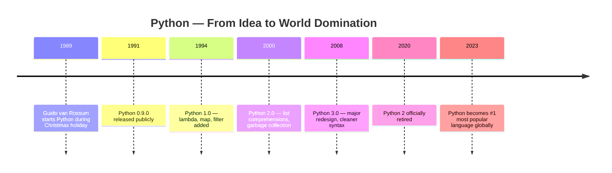
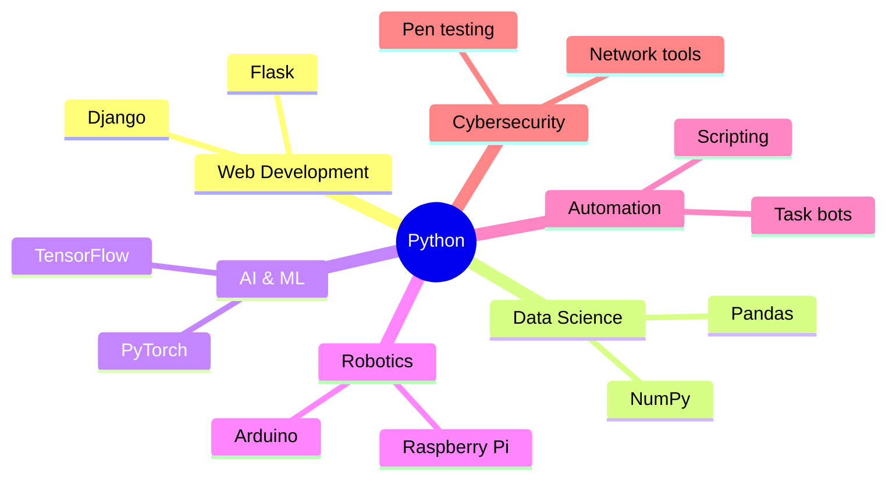

# Lesson 01 — Welcome to Python

!!! info "Lesson Info"
    **Track:** Python &nbsp;|&nbsp; **Module:** 01 — Basics &nbsp;|&nbsp;
    **Duration:** 60 minutes &nbsp;|&nbsp; **Difficulty:** 🟢 Beginner

---

## 🎯 Learning Objectives

!!! success "By the end of this lesson, you will be able to:"
    - [x] Explain what Python is and where it came from
    - [x] List 5 real-world applications of Python
    - [x] Set up Python using VS Code or Replit
    - [x] Write and run your first Python program

---

## 🧠 What is Python?

Python is a **high-level, general-purpose programming language** — designed
to be easy for humans to read and write, and powerful enough to build almost
anything: websites, games, robots, AI systems, and more.

!!! quote "The Zen of Python"
    *"Beautiful is better than ugly. Simple is better than complex.
    Readability counts."*
    — Tim Peters (from `import this`)

---

## 🕰️ History & Development



!!! warning "Always use Python 3"
    Python 2 was retired in 2020. It receives **no updates and no security
    fixes**. Never start a new project in Python 2.

---

## ⭐ Key Features

!!! abstract "Why Python stands out"

    | Feature | What it means for you |
    |---|---|
    | **Easy to read** | Code looks like plain English |
    | **Free & open source** | Use it forever, no cost |
    | **Interpreted** | Runs line by line — no compiling step |
    | **Cross-platform** | Works on Windows, Mac, Linux |
    | **Huge library** | Thousands of built-in tools |
    | **Beginner-friendly** | Best first language to learn |

---

## 🌍 Applications of Python



---

## 💻 Choosing Your Editor

!!! tip "Which editor should I use?"
    - Use **Replit** if you want to start in the next 2 minutes (online, free)
    - Use **VS Code** if you want a professional offline setup

=== "Replit (Online)"

    **Setup time: ~2 minutes**

    1. Go to [replit.com](https://replit.com) and sign up
    2. Click **+ Create Repl** → Select **Python**
    3. Name it `code-core-python` → Click **Create**
    4. Type your code in the editor → Click **▶ Run**

```python
    # Your first program — type this exactly
    print("Hello, World!")
    print("I am learning Python!")
```

=== "VS Code (Offline)"

    **Setup time: ~15 minutes**

    **Step 1 — Install Python**

    Go to [python.org/downloads](https://www.python.org/downloads/) and download Python 3.

```bash
    # Verify installation in your terminal
    python --version
    # Expected output:
    # Python 3.12.x
```

    !!! danger "Windows users — critical step"
        On the installer's first screen, tick **"Add Python to PATH"**
        before clicking Install. Skipping this breaks everything.

    **Step 2 — Install VS Code**

    Go to [code.visualstudio.com](https://code.visualstudio.com/) and download.

    **Step 3 — Install Python Extension**

    In VS Code → Extensions panel → Search `Python` → Install **Python by Microsoft**

    **Step 4 — Run your file**

```bash
    # In the VS Code terminal
    python lesson01.py
```

---

## 🛠️ Your First Program

Write this in your editor:

```python title="lesson01.py"
# ================================
# My First Python Program
# ================================

print("Hello, World!")                    # (1)
print("My name is [YOUR NAME]")           # (2)
print("I am learning Python today!")      # (3)
```

1. `print()` sends text to the screen. Always use quotes around text.
2. Replace `[YOUR NAME]` with your actual name.
3. Every `print()` starts on a new line automatically.

**Expected output:**