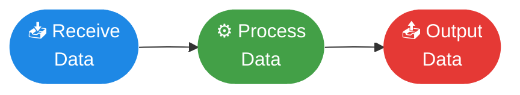
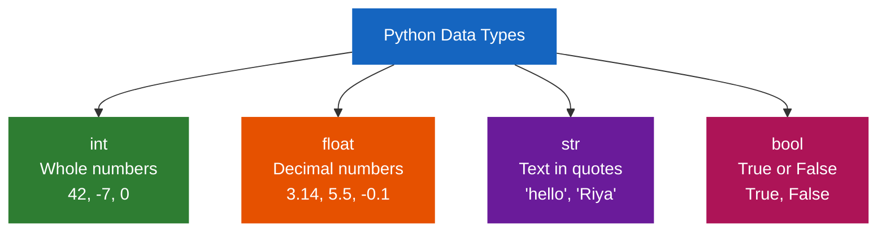
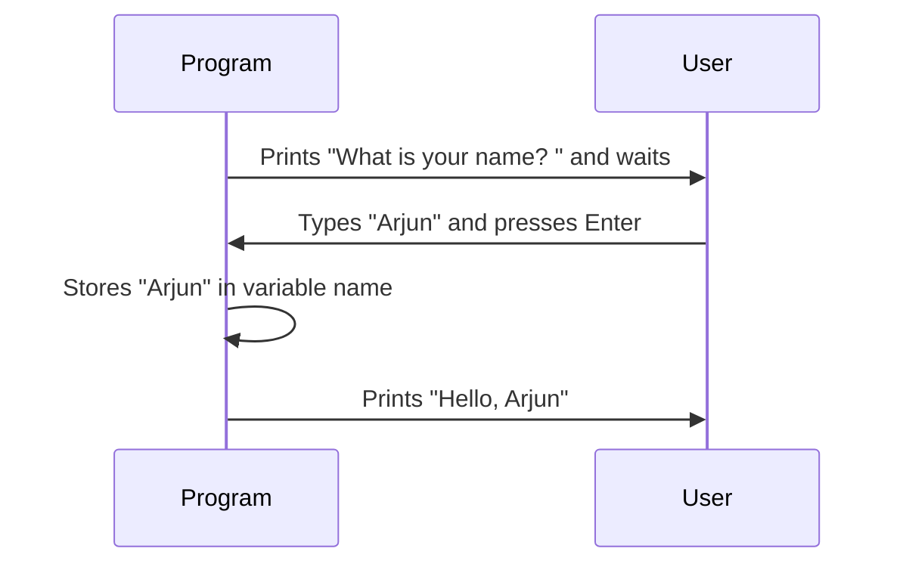
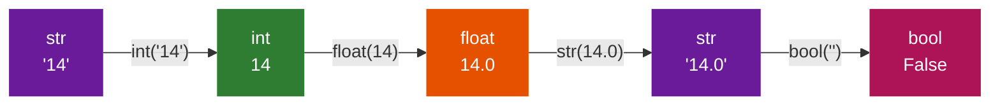

# Lesson 02 — Variables, Data Types & Input/Output

<div class="grid cards" markdown>

-   ⏱️ **Duration**

    70 minutes

-   🎯 **Track**

    Python — Module 01

-   📊 **Difficulty**

    🟢 Beginner

-   📦 **Requires**

    Lesson 01 complete · Python installed

</div>

---

## 🎯 Learning Objectives

!!! success "By the end of this lesson you will be able to:"

    - [x] Explain what data is and why programs need to store it
    - [x] Create variables using correct naming rules
    - [x] Identify and use Python's four core data types
    - [x] Take user input with `input()` and display output with `print()`
    - [x] Write formatted and unformatted output
    - [x] Add comments and understand why indentation matters
    - [x] Convert between data types using typecasting
    - [x] Perform essential string operations

---

## 🧠 What is Data?

**Data** is any piece of information a program works with.

Your name is data. Your age is data. Whether today is sunny — data.
Whether you passed your exam — data. The number of students in a
classroom — data.

Every program ever written follows the same three steps:



Without data, a program has nothing to work with.

---

## 📦 What is a Variable?

A **variable** is a named storage location in memory that holds
a piece of data.

!!! quote "The Analogy"
    Think of a variable like a **labeled box in a storage room**.

    Each box has a **label** (the variable name) and something
    **inside it** (the value). You can open the box, look inside,
    take out the old thing, and put in something new.

    `score = 95` means:
    *"Find the box labeled `score` and put the value `95` inside it."*

### Creating a Variable

```python
variable_name = value
```

The `=` sign is the **assignment operator**. It does not mean
"equals" — it means "store this value in this variable."

```python
student_name = "Meera"      # store text
age          = 14           # store a whole number
height       = 5.4          # store a decimal number
is_enrolled  = True         # store True or False
```

---

## 🏷️ Rules for Naming Variables

!!! warning "These are enforced by Python — break them and your code won't run"

=== "✅ Rules you MUST follow"

    | Rule | Correct | Wrong |
    |---|---|---|
    | Start with a letter or underscore | `name`, `_score` | `1name`, `9lives` |
    | Only letters, numbers, underscores | `my_score`, `level2` | `my-score`, `my score` |
    | No spaces | `first_name` | `first name` |
    | Case-sensitive | `Name` ≠ `name` | — |
    | No Python keywords | `score`, `total` | `if`, `for`, `class` |

=== "✅ Conventions you SHOULD follow"

    | Convention | Why | Example |
    |---|---|---|
    | Use lowercase | Standard Python style (PEP 8) | `student_name` |
    | Use underscores for spaces | Readable | `first_name` not `firstname` |
    | Make names meaningful | Code should read like English | `student_count` not `sc` |
    | Avoid single letters | Except in loops or maths | `score` not `s` |

=== "🚫 Reserved Keywords"

    Never use these as variable names — Python owns them:

    ```
    False    None     True     and      as       assert
    async    await    break    class    continue def
    del      elif     else     except   finally  for
    from     global   if       import   in       is
    lambda   nonlocal not      or       pass     raise
    return   try      while    with     yield
    ```

---

## 🗂️ The Four Core Data Types



=== "🔢 int — Integer"

    Whole numbers. No decimal point. Positive or negative.

    ```python
    age            = 14
    score          = 95
    temperature    = -3
    year           = 2024
    student_count  = 30
    ```

    Used for: counting, indexing, whole-number maths.

=== "🔣 float — Floating Point"

    Decimal numbers. Has a decimal point.

    ```python
    height      = 5.4
    gpa         = 3.85
    pi          = 3.14159
    price       = 199.99
    temperature = 36.6
    ```

    Used for: measurements, prices, scientific values.

=== "📝 str — String"

    Text. Always wrapped in quotes — single `'` or double `"`.

    ```python
    name      = "Arjun"
    city      = 'Kathmandu'
    message   = "Hello, World!"
    empty     = ""              # empty string is valid
    ```

    Can contain letters, numbers, symbols, spaces.
    Used for: names, messages, any human-readable text.

=== "✅ bool — Boolean"

    Only two possible values: `True` or `False`.
    Capital T and F are required.

    ```python
    is_enrolled = True
    has_passed  = False
    is_raining  = True
    is_empty    = False
    ```

    Used for: yes/no decisions, conditions, flags.

### Checking a Variable's Type

```python
score   = 95
name    = "Meera"
height  = 5.4
passed  = True

print(type(score))    # <class 'int'>
print(type(name))     # <class 'str'>
print(type(height))   # <class 'float'>
print(type(passed))   # <class 'bool'>
```

!!! example "Try this"
    Create one variable of each type and print its `type()`.
    Can you find a case where Python guesses the type incorrectly?

---

## ⌨️ Getting Input from the User

The `input()` function pauses your program and waits for the user
to type something and press Enter.

```python
name = input("What is your name? ")
print("Hello,", name)
```

**What happens step by step:**



!!! warning "input() ALWAYS returns a string"

    Even if the user types `14`, Python stores it as the text `"14"`,
    not the number `14`.

    ```python
    age = input("Enter your age: ")
    print(type(age))    # <class 'str'> — NOT int!
    ```

    This matters when you want to do maths — see Typecasting below.

---

## 🖨️ Output — Two Types

=== "Unformatted Output"

    Simply printing values separated by commas:

    ```python
    name = "Riya"
    age  = 13

    print(name)                        # Riya
    print(age)                         # 13
    print("Name:", name)               # Name: Riya
    print("Name:", name, "Age:", age)  # Name: Riya Age: 13
    ```

    **Customising print() behaviour:**

    ```python
    # Change the separator (default is a space)
    print("Python", "is", "great", sep="-")   # Python-is-great
    print("Python", "is", "great", sep="")    # Pythonisgreat

    # Change the end character (default is newline)
    print("Hello", end=" ")
    print("World")                             # Hello World

    # Print a blank line
    print()
    ```

=== "Formatted Output (f-strings)"

    **F-strings are the recommended modern approach.**
    Prefix the string with `f` and put variable names inside `{}`.

    ```python
    name = "Arjun"
    age  = 14
    gpa  = 3.85

    print(f"Name: {name}")
    print(f"Age: {age}")
    print(f"GPA: {gpa:.2f}")     # .2f = 2 decimal places

    print(f"{name} is {age} years old with a GPA of {gpa:.1f}")
    ```

    Output:
    ```
    Name: Arjun
    Age: 14
    GPA: 3.85
    Arjun is 14 years old with a GPA of 3.9
    ```

    **Other formatting options:**

    ```python
    price = 1999.5
    print(f"Price: ${price:.2f}")      # Price: $1999.50
    print(f"Score: {95:>10}")          # right-align in 10 chars
    print(f"{'TITLE':^30}")            # centre in 30 chars
    ```

---

## 💬 Comments in Python

A **comment** is a line Python completely ignores. Written for humans.

```python
# This is a single-line comment

name = "Arjun"    # Inline comment — after the code on same line

"""
This is a multi-line comment (technically a docstring).
Use it to describe what a file or function does.
Python ignores everything inside triple quotes.
"""
```

**Why comments matter:**

```python
# WITHOUT comments — confusing:
x = 86400
y = x * 30

# WITH comments — immediately clear:
seconds_per_day   = 86400        # 60 sec × 60 min × 24 hours
seconds_per_month = seconds_per_day * 30
```

!!! tip "Comment the WHY, not the WHAT"
    If the code is already clear, don't over-explain.
    If the logic is complex or non-obvious, always explain your reasoning.

---

## ↩️ Indentation in Python

In most languages, indentation is just style. In Python,
**indentation is part of the syntax** — it defines structure.

```python
# CORRECT
if 10 > 5:
    print("Ten is greater")    # 4 spaces — inside the if block
    print("This runs too")     # same indent — still inside
print("This always runs")      # no indent — outside the if block

# WRONG — IndentationError
if 10 > 5:
print("Ten is greater")        # ❌ Missing indent — Python errors here
```

!!! warning "Indentation rules"
    - Always use **4 spaces** per indent level (the Python standard)
    - Never mix tabs and spaces
    - Everything inside a block must be at the same level

We use indentation heavily from Lesson 03 onwards — for now, just
know: **Python uses spacing to understand your program's structure.**

---

## 🔄 Typecasting

**Typecasting** means converting a value from one data type to another.



=== "Implicit (Python does it automatically)"

    Python quietly converts types when it makes sense:

    ```python
    num_int   = 5      # int
    num_float = 2.5    # float

    result = num_int + num_float
    print(result)        # 7.5
    print(type(result))  # <class 'float'>
    ```

    Python upgraded the result to `float` so no precision is lost.

    ```python
    print(3 + 4.0)      # 7.0  — int + float = float
    print(True + 5)     # 6    — True is internally 1
    print(False + 10)   # 10   — False is internally 0
    ```

=== "Explicit (you do it manually)"

    | Function | Converts to | Example |
    |---|---|---|
    | `int()` | Integer | `int("14")` → `14` |
    | `float()` | Float | `float("3.14")` → `3.14` |
    | `str()` | String | `str(42)` → `"42"` |
    | `bool()` | Boolean | `bool(0)` → `False` |

    ```python
    # Most common real-world scenario
    age_text   = input("Enter your age: ")   # "14" — a string
    age_number = int(age_text)               # 14   — now a number
    birth_year = 2024 - age_number
    print(f"You were born around {birth_year}")
    ```

    **Shortcut — convert directly inside input():**

    ```python
    age   = int(input("Enter your age: "))
    price = float(input("Enter the price: "))
    ```

=== "What can go wrong"

    ```python
    int("hello")     # ❌ ValueError — not a valid number
    int("3.14")      # ❌ ValueError — can't convert decimal string to int
    float("3.14")    # ✅ Works fine
    int(float("3.14"))  # ✅ "3.14" → 3.14 → 3
    ```

    !!! danger "Always convert input before doing maths"
        If you try `int("hello")` Python crashes with a `ValueError`.
        Later we will learn how to handle these errors gracefully.

---

## 🔤 String Operations

Strings are far more powerful than just storing text.

=== "Basic Operations"

    ```python
    # Concatenation — joining strings
    first = "Code"
    second = "Core"
    print(first + second)        # CodeCore
    print(first + " " + second)  # Code Core

    # Repetition
    print("-" * 30)              # ------------------------------
    print("Ha" * 3)              # HaHaHa

    # Length
    name = "Kathmandu"
    print(len(name))             # 9
    print(len(""))               # 0
    ```

=== "Indexing & Slicing"

    Every character has a position starting from 0:

    ```python
    name = "Python"
    #       P  y  t  h  o  n
    # index: 0  1  2  3  4  5
    # neg:  -6 -5 -4 -3 -2 -1

    print(name[0])      # P   — first character
    print(name[-1])     # n   — last character
    print(name[0:3])    # Pyt — index 0 up to (not including) 3
    print(name[2:])     # thon — from index 2 to end
    print(name[:4])     # Pyth — from start to index 4
    print(name[::-1])   # nohtyP — reversed!
    ```

=== "String Methods"

    ```python
    text = "  Hello, Python World!  "

    # Case
    print(text.upper())           # "  HELLO, PYTHON WORLD!  "
    print(text.lower())           # "  hello, python world!  "
    print(text.title())           # "  Hello, Python World!  "

    # Whitespace
    print(text.strip())           # "Hello, Python World!"
    print(text.lstrip())          # "Hello, Python World!  "
    print(text.rstrip())          # "  Hello, Python World!"

    # Searching
    print(text.find("Python"))    # 9 — index where it starts
    print(text.count("l"))        # 3 — how many times
    print("Python" in text)       # True

    # Replacing & Splitting
    print(text.replace("Python", "World"))
    fruits = "apple,mango,banana".split(",")
    print(fruits)                 # ['apple', 'mango', 'banana']

    # Checking content
    print("hello".isalpha())      # True  — only letters
    print("123".isdigit())        # True  — only digits
    print("hello123".isalnum())   # True  — letters and/or digits
    ```

---

## 🛠️ Step-by-Step Activity

!!! info "What we are building"
    A **Student Profile Card** — a program that collects your
    information and prints a neatly formatted card.

**File:** `lesson02.py`

**Step 1 — Collect input**

```python
# lesson02.py — Student Profile Card

print("===== STUDENT PROFILE GENERATOR =====")
print()

name    = input("Enter your full name    : ")
age     = int(input("Enter your age         : "))
city    = input("Enter your city         : ")
subject = input("Favourite subject       : ")
score   = float(input("Score in that subject  : "))
```

**Step 2 — Process the data**

```python
# Assign a grade based on score
if score >= 90:
    grade = "A+"
elif score >= 80:
    grade = "A"
elif score >= 70:
    grade = "B"
elif score >= 60:
    grade = "C"
else:
    grade = "D"
```

**Step 3 — Display the formatted card**

```python
border = "=" * 40

print()
print(border)
print("         STUDENT PROFILE CARD")
print(border)
print(f"  Name      : {name}")
print(f"  Age       : {age} years")
print(f"  City      : {city}")
print(f"  Subject   : {subject}")
print(f"  Score     : {score:.1f} / 100")
print(f"  Grade     : {grade}")
print(border)
print(f"  Name (CAPS) : {name.upper()}")
print(f"  Name length : {len(name)} characters")
print(border)
```

**Expected output:**

```
===== STUDENT PROFILE GENERATOR =====

Enter your full name    : Arjun Sharma
Enter your age         : 14
Enter your city         : Kathmandu
Favourite subject       : Mathematics
Score in that subject  : 87.5

========================================
         STUDENT PROFILE CARD
========================================
  Name      : Arjun Sharma
  Age       : 14 years
  City      : Kathmandu
  Subject   : Mathematics
  Score     : 87.5 / 100
  Grade     : B
========================================
  Name (CAPS) : ARJUN SHARMA
  Name length : 12 characters
========================================
```

!!! danger "If you get a ValueError"
    Check that `int()` or `float()` wrap your `input()` calls for
    number fields. You cannot do maths with a string.

---

## 🏋️ Practice Exercise

!!! question "Exercise — Personal Calculator"

    Write a program that:

    1. Asks for the user's name
    2. Asks for two numbers as floats
    3. Asks which operation: `add`, `subtract`, `multiply`, or `divide`
    4. Displays the result in a formatted sentence

    **Expected output:**
    ```
    Enter your name: Meera
    Enter first number: 24.5
    Enter second number: 6
    Operation (add/subtract/multiply/divide): multiply

    -----------------------------------
    Meera's result: 24.5 × 6.0 = 147.0
    -----------------------------------
    ```

    ??? tip "Hint — click to reveal"
        Use `float(input(...))` to get numbers.
        Use a simple `if` for each operation:
        ```python
        if operation == "add":
            result = num1 + num2
        ```
        We cover this fully in Lesson 03 — for now write one `if`
        per operation.

---

## 🔥 Challenge

!!! danger "Challenge — Smart Name Analyser"

    Ask the user for their full name and print a detailed analysis:

    **Must include:**

    - Total length including spaces
    - First name and last name length separately (use `.split()`)
    - Name in ALL CAPS and all lowercase
    - First character and last character
    - Number of vowels (`a e i o u` — upper and lower)
    - Whether the name has more than 10 characters (`True`/`False`)

    **Expected output (for "Arjun Sharma"):**
    ```
    ===== NAME ANALYSIS =====
    Full name     : Arjun Sharma
    Full length   : 12 characters
    First name    : Arjun  (5 chars)
    Last name     : Sharma (6 chars)
    Uppercase     : ARJUN SHARMA
    Lowercase     : arjun sharma
    First char    : A
    Last char     : a
    Vowel count   : 4
    Long name?    : True
    =========================
    ```

    **Extension ideas:**

    - Check if first name and last name start with the same letter
    - Print the name reversed using slicing `name[::-1]`

---

## 🧪 Quick Quiz

!!! question "Test yourself — no looking back"

    **1.** Which is NOT a valid Python variable name?

    - A) `my_score`
    - B) `score2`
    - C) `2score`
    - D) `_hidden`

    ---

    **2.** What does this code output?

    ```python
    x = "5"
    y = 3
    print(x * y)
    ```

    - A) `8`
    - B) `15`
    - C) `555`
    - D) An error

    ---

    **3.** After this line runs, what is the data type of `age`?

    ```python
    age = input("Enter age: ")
    ```

    - A) `int`
    - B) `float`
    - C) `str`
    - D) `bool`

    ---

    **4.** What does `"Hello World".upper().replace("O", "0")` return?

    - A) `"hello world"`
    - B) `"HELL0 W0RLD"`
    - C) `"HELLO WORLD"`
    - D) An error

    ---

    **5.** Write one line of Python that asks the user for a number
    and immediately stores it as a `float`.

    ??? success "Answer Key — click to reveal"

        | # | Answer | Explanation |
        |---|--------|-------------|
        | 1 | **C** `2score` | Variable names cannot start with a digit |
        | 2 | **C** `555` | `"5" * 3` repeats the string 3 times — string repetition |
        | 3 | **C** `str` | `input()` always returns a string regardless of what is typed |
        | 4 | **B** `"HELL0 W0RLD"` | `.upper()` first, then O replaced with zero |
        | 5 | `number = float(input("Enter a number: "))` | |

---

## 🌐 Real-World Connection

Everything in this lesson is used in production software every day:

- **Variables** hold user account data, session tokens, game scores
- **Data types** determine how databases store and query information
- **`input()`** powers CLI tools, configuration scripts, admin panels
- **String methods** clean user-submitted form data before saving
- **Typecasting** is essential in APIs where all data arrives as text
- **f-strings** generate email templates, reports, and dashboards

---

## 📝 Lesson Summary

| Concept | Key Detail | Quick Example |
|---|---|---|
| **Variable** | Named container for a value | `score = 95` |
| **int** | Whole numbers | `age = 14` |
| **float** | Decimal numbers | `gpa = 3.85` |
| **str** | Text in quotes | `name = "Arjun"` |
| **bool** | True or False only | `passed = True` |
| **input()** | Get text from user | `name = input("Name: ")` |
| **print()** | Show output | `print(f"Hi {name}")` |
| **f-string** | Formatted output | `f"Age: {age}"` |
| **Comment** | Note Python ignores | `# this is a note` |
| **Indentation** | 4 spaces = inside a block | Used in if/loops |
| **int()** | Explicit cast to integer | `int("14")` → `14` |
| **float()** | Explicit cast to decimal | `float("3.14")` → `3.14` |
| **len()** | Length of a string | `len("hello")` → `5` |
| **.upper()** | Convert to uppercase | `"hi".upper()` → `"HI"` |
| **.split()** | Split into a list | `"a,b".split(",")` → `["a","b"]` |

**Key takeaways:**

- 📌 `input()` **always** returns a string — always typecast for maths
- 📌 Use **f-strings** for formatted output — cleanest modern approach
- 📌 String methods return a **new string** — they don't change the original
- 📌 **Indentation** is not optional — it defines your program's structure

---

## ✅ Before Moving On

!!! success "Confirm all five before going to Lesson 03"

    - [x] I can create variables of all 4 core data types
    - [x] I understand why `input()` returns a string
    - [x] I built and ran the Student Profile Card
    - [x] I completed the Personal Calculator exercise
    - [x] I can explain implicit vs explicit typecasting

---

## ➡️ Next Lesson

**Lesson 03** teaches Python to make decisions — `if`, `elif`,
`else`, comparison operators, and logical operators.

[Lesson 03 — Control Flow :octicons-arrow-right-24:](lesson-03.md)

---

*Lesson 02 of 03 · Python Track · Module 01 — Basics · Code & Core Learning System*