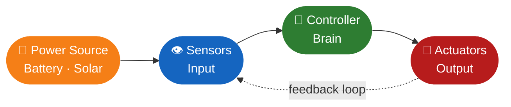
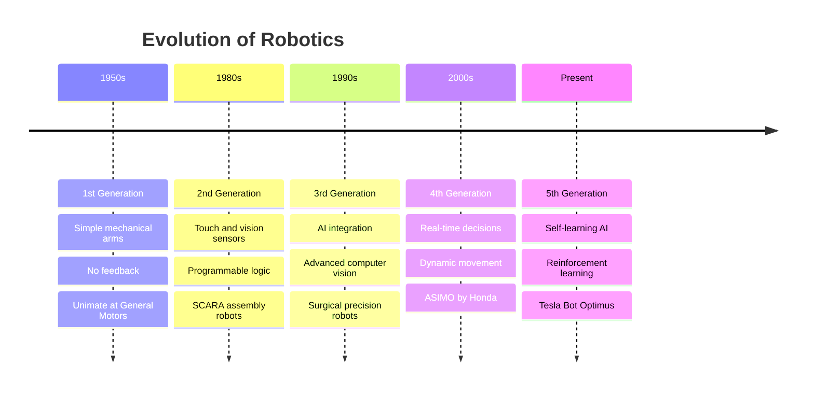
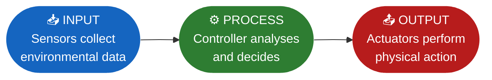

# Lesson 01 — Introduction to Robotics

<div class="grid cards" markdown>

-   ⏱️ **Duration**

    60 minutes

-   🎯 **Track**

    Robotics — Module 01

-   📊 **Difficulty**

    🟢 Beginner

-   📦 **Requires**

    Nothing — start from zero

</div>

---

## 🎯 Learning Objectives

!!! success "By the end of this lesson you will be able to:"

    - [x] Define what a robot is and describe its key characteristics
    - [x] Identify and explain the four main components of a robotic system
    - [x] Trace the history and evolution of robotics across five generations
    - [x] Explain how robots work using the IPO model
    - [x] Distinguish between open-loop and closed-loop control systems

---

## 🧠 What is a Robot?

A **robot** is an autonomous or semi-autonomous machine designed to
perform one or more tasks automatically. It does this by:

- **Sensing** its environment using sensors like cameras or touch sensors
- **Processing** that information through a controller or computer program
- **Acting** on the world using actuators such as motors or arms

### Key Characteristics

!!! abstract "Every robot must be able to:"

    | Characteristic | Description |
    |---|---|
    | **Sense** | Detect information from the environment |
    | **Process** | Make decisions based on that information |
    | **Act** | Carry out physical actions |
    | **Operate** | Work autonomously or semi-autonomously |

!!! quote "The Analogy"
    Think of a robot like a **well-trained chef in a kitchen**.

    Just like a chef looks at ingredients (sensing), decides what to
    cook (processing), and then chops, stirs, and plates (acting) —
    a robot uses sensors to gather data, a controller to decide what
    to do, and actuators to carry out the action.

    *A Roomba vacuum senses dirt, processes a cleaning path, and
    drives its wheels to clean — exactly like a chef responding to
    what's in front of them.*

---

## 🔩 The Four Components of a Robotic System



=== "👁️ Sensors — The Eyes & Ears"

    Sensors help the robot gather information about its surroundings.

    - **What they do:** Detect and measure physical inputs from the environment
    - **Examples:** Camera, ultrasonic sensor, temperature sensor, touch sensor
    - **Analogy:** Like your eyes and ears feeding raw data to your brain

    | Sensor | What it detects |
    |---|---|
    | Camera | Light, colour, objects, faces |
    | Ultrasonic | Distance to nearby objects |
    | Temperature | Heat levels in the environment |
    | Touch | Physical contact or pressure |
    | IR sensor | Infrared light, proximity |

=== "🧠 Controller — The Brain"

    The controller is the decision-making unit — usually a
    microcontroller or computer.

    - **What it does:** Receives sensor data, runs program logic, sends commands to actuators
    - **Examples:** Arduino, Raspberry Pi, dedicated robot CPU
    - **Analogy:** Like the human brain processing everything you sense, then deciding how to respond

    !!! info "In our Robotics track"
        We use the **Arduino Uno** as our controller — a small, affordable
        microcontroller that is the industry standard for learning robotics.

=== "💪 Actuators — The Muscles"

    Actuators convert electrical signals into physical movement.

    - **What they do:** Make the robot move or interact with the world
    - **Examples:** DC motors, servo motors, robotic arms, wheels, buzzers
    - **Analogy:** Like your arms and legs responding to your brain's commands

    | Actuator | What it does |
    |---|---|
    | DC motor | Continuous rotation — wheels, fans |
    | Servo motor | Precise angle control — robot arms |
    | Buzzer | Produces sound alerts |
    | LED | Visual output signals |

=== "🔋 Power Source — The Energy"

    Every robot needs energy to function.

    - **What it does:** Supplies electricity to sensors, controller, and actuators
    - **Examples:** Batteries, solar panels, fuel cells
    - **Analogy:** Like food giving your body the energy to move and think

---

## 🕰️ History & Evolution of Robotics

### Early Concepts

Long before modern robots existed, humans dreamed of mechanical beings:

- **Ancient myths** featured mechanical beings — *Talos* in Greek mythology
- **Leonardo da Vinci** sketched a robotic knight design in the 1400s
- **1920** — Czech playwright Karel Čapek coins the word **"robot"**
  from the Czech word *robota* meaning forced labour

### Five Generations of Robots



| Generation | Era | Key Advancement | Example |
|---|---|---|---|
| **1st** | 1950s | Simple mechanical arms, no feedback | Unimate — welding at GM |
| **2nd** | 1980s | Sensors + programmable logic | SCARA assembly robots |
| **3rd** | 1990s | AI integration, computer vision | Surgical precision robots |
| **4th** | 2000s | Real-time decisions, dynamic movement | ASIMO — navigates stairs |
| **5th** | Present | Self-learning AI, LLMs | Tesla Bot (Optimus) |

!!! info "Key milestone"
    In **1961**, the first industrial robot — Unimate — was deployed
    at a General Motors factory to perform repetitive welding tasks.
    It worked 24 hours a day without breaks and never made the same
    mistake twice.

---

## ⚙️ How Robots Work — The IPO Model

Every robot follows the same fundamental cycle:



**Real-world example — Roomba vacuum robot:**

| Stage | What happens |
|---|---|
| **Input** | Dirt sensor detects debris on floor |
| **Process** | Controller maps the optimal cleaning path |
| **Output** | Wheels move to clean the detected area |

!!! example "Try this thinking exercise"
    Pick any robot you know — a self-driving car, a drone, a factory arm.
    Map it to the IPO model:

    - What does it **sense**?
    - What does it **decide**?
    - What **action** does it take?

---

## 🔄 Control Systems — Open-Loop vs Closed-Loop

Not all robots respond the same way to their environment.
There are two fundamental types of control systems:

=== "Open-Loop (No Feedback)"

    Actions are pre-set and run without checking if the goal was achieved.

    ```mermaid
    flowchart LR
        A(["Input\nCommand"]) --> B(["Controller"])
        B --> C(["Actuator\nAction"])

        style A fill:#1565c0,color:#fff,stroke:none
        style B fill:#2e7d32,color:#fff,stroke:none
        style C fill:#b71c1c,color:#fff,stroke:none
    ```

    **Strength:** Simple and predictable

    **Weakness:** Cannot adapt to errors or unexpected changes

    !!! example "Microwave Oven"
        You set 2 minutes → it runs → it stops.
        It does **not** check whether your food is actually hot.
        It just runs for the time you set — no matter what.

    **More examples:** Traffic lights on a fixed timer, automatic
    sprinklers set to a schedule, a conveyor belt at fixed speed.

=== "Closed-Loop (With Feedback)"

    The robot continuously checks its output and adjusts in real time.

    ```mermaid
    flowchart LR
        A(["Input\nCommand"]) --> B(["Controller"])
        B --> C(["Actuator\nAction"])
        C --> D(["Sensor\nMeasures result"])
        D -->|"feedback"| B

        style A fill:#1565c0,color:#fff,stroke:none
        style B fill:#2e7d32,color:#fff,stroke:none
        style C fill:#b71c1c,color:#fff,stroke:none
        style D fill:#f57f17,color:#fff,stroke:none
    ```

    **Strength:** Self-correcting and adaptive

    **Weakness:** More complex to design and program

    !!! example "Air Conditioner with Thermostat"
        You set 22°C → it checks room temperature → adjusts cooling
        → keeps checking → corrects until it reaches exactly 22°C.

    **More examples:** Cruise control in cars, autopilot in aircraft,
    balance control in a self-balancing robot.

=== "Comparison Table"

    | Feature | Open-Loop | Closed-Loop |
    |---|---|---|
    | Feedback | ❌ None | ✅ Continuous |
    | Adaptability | ❌ Fixed behaviour | ✅ Self-correcting |
    | Complexity | 🟢 Simple | 🟡 More complex |
    | Error handling | ❌ Cannot detect errors | ✅ Detects and corrects |
    | Cost | 🟢 Lower | 🟡 Higher |
    | Example | Microwave, traffic light | AC thermostat, cruise control |

---

## 🛠️ Step-by-Step Activity

!!! info "What we are building"
    A **Robot Component Map** — you will map a real robot to the
    IPO model and identify all four of its components.

**What you need:**

- [ ] Paper and pencil (or Google Slides / Canva for a digital version)

---

**Step 1 — Choose your robot**

Pick one of these (or any robot you know):

- 🤖 Roomba (vacuum robot)
- 🦾 ASIMO (humanoid robot by Honda)
- 🚗 Self-driving car (Tesla Autopilot)
- 🚀 NASA Perseverance Mars Rover

---

**Step 2 — Map the four components**

Draw a box for each component and fill it in for your chosen robot:

```
┌─────────────────────────────────────────────┐
│  Robot: _________________________________    │
├──────────────┬──────────────────────────────┤
│  Sensors     │                              │
│  (Input)     │  What does it detect?        │
├──────────────┼──────────────────────────────┤
│  Controller  │                              │
│  (Brain)     │  What decisions does it make?│
├──────────────┼──────────────────────────────┤
│  Actuators   │                              │
│  (Output)    │  How does it move or act?    │
├──────────────┼──────────────────────────────┤
│  Power       │                              │
│  Source      │  How is it powered?          │
└──────────────┴──────────────────────────────┘
```

---

**Step 3 — Apply the IPO model**

Write one sentence for each:

```
INPUT   : The robot collects _________________________ data.
PROCESS : It decides to ________________________________.
OUTPUT  : It then ______________________________________.
```

---

**Step 4 — Classify the control system**

```
My robot is [open / closed]-loop because:
_________________________________________________
```

!!! tip "Not sure which type?"
    Ask yourself: *"Does the robot check if it achieved its goal and
    adjust?"*

    - Yes → **Closed-loop**
    - No → **Open-loop**

---

## 🏋️ Practice Exercise

!!! question "Exercise — Design Your Own Robot Concept"

    Imagine a robot that solves a real problem in your school or home.

    **Requirements:**

    - Give your robot a name and describe its purpose in 1–2 sentences
    - List at least 2 sensors it would need and explain why
    - Describe the actuators it would need to complete its task
    - State whether it would be open-loop or closed-loop — and why

    **Fill in this template:**
    ```
    Robot Name   : ___________________________
    Purpose      : ___________________________
    Sensor 1     : ___________ — detects ____
    Sensor 2     : ___________ — detects ____
    Actuators    : ___________________________
    Control Type : [Open / Closed]-Loop
    Reason       : ___________________________
    ```

    ??? tip "Hint — click to reveal"
        Think about a daily problem — forgetting to water plants,
        losing track of objects, monitoring room temperature.

        Ask yourself:

        - What would the robot need to **sense** to detect the problem?
        - What would it need to **do** to fix it?
        - Would it need to **check** if it succeeded? (→ closed-loop)

---

## 🔥 Challenge

!!! danger "Challenge — Evolution Timeline Comparison"

    Pick **two generations of robots** (e.g., 1st and 5th).

    Write a short comparison (5–8 sentences) covering:

    - What tasks each generation could and could not do
    - What technology made the newer generation possible
    - How you think robots will evolve into a **6th generation** —
      what would they be capable of?

    **Extension ideas:**

    - Research one specific robot from each generation — find a photo
      or video and describe what makes it remarkable
    - Write a mini debate:
      *"Should robots replace humans in dangerous jobs?"*
      — 3 points for, 3 points against

---

## 🧪 Quick Quiz

!!! question "Test yourself — no looking back"

    **1.** Which component of a robot acts as its "brain"?

    - A) Sensor
    - B) Actuator
    - C) Controller
    - D) Power Source

    ---

    **2.** A robot arm is pre-programmed to weld 10 bolts in sequence,
    regardless of whether each weld was successful.
    What type of control system is this?

    - A) Closed-loop
    - B) Feedback loop
    - C) Open-loop
    - D) Adaptive loop

    ---

    **3.** What does the **P** stand for in the IPO model?

    - A) Power
    - B) Process
    - C) Program
    - D) Perform

    ---

    **4.** True or False: 5th generation robots can learn new tasks
    by observing humans without being manually reprogrammed.

    ---

    **5.** Name two real-world applications of robotics and explain
    how robots help in each area.

    ??? success "Answer Key — click to reveal"

        | # | Answer | Explanation |
        |---|--------|-------------|
        | 1 | **C** Controller | The controller is the decision-making unit that runs the program |
        | 2 | **C** Open-loop | No feedback — the robot does not check if each weld succeeded |
        | 3 | **B** Process | IPO = Input (sensing) → Process (decisions) → Output (action) |
        | 4 | **True** | 5th gen robots like Tesla Optimus use reinforcement learning to improve |
        | 5 | *Healthcare:* surgical robots enable minimally invasive procedures · *Space:* NASA rovers operate autonomously in environments humans cannot survive |

---

## 🌐 Real-World Connection

Robotics is embedded in everyday life across every major industry:

- **Manufacturing** — robots weld, paint, and assemble cars 24/7
  without fatigue or error
- **Healthcare** — the Da Vinci surgical robot allows procedures
  with precision far beyond human hands
- **Space exploration** — NASA's Perseverance rover operates
  autonomously on Mars, collecting data where no human can go
- **Agriculture** — autonomous drones monitor crop health and
  apply fertiliser with millimetre precision
- **Home** — Roomba navigates and cleans rooms intelligently using
  closed-loop control

Every robot in every one of these fields uses the same four
components and the same IPO model you learned today.

---

## 📝 Lesson Summary

| Concept | What it does | Example |
|---|---|---|
| **Sensor** | Collects environmental data — Input | Camera, ultrasonic, temperature |
| **Controller** | Processes data, makes decisions — Brain | Arduino, Raspberry Pi |
| **Actuator** | Carries out physical actions — Output | Motor, servo, robotic arm |
| **Power Source** | Supplies energy to all components | Battery, solar panel |
| **IPO Model** | Input → Process → Output flow | Dirt → map path → move wheels |
| **Open-Loop** | No feedback — pre-set actions | Microwave oven |
| **Closed-Loop** | Continuous feedback, self-correcting | AC thermostat, cruise control |

**Key takeaways:**

- 📌 A robot must **sense**, **process**, and **act** — all three are essential
- 📌 The **IPO model** describes how every robotic system flows from input to output
- 📌 **Closed-loop** systems are smarter because they self-correct using real-time feedback

---

## ✅ Before Moving On

!!! success "Confirm all three before going to Lesson 02"

    - [x] I completed the Robot Component Map activity
    - [x] I designed my own robot concept in the exercise
    - [x] I can explain the IPO model and the difference between
          open-loop and closed-loop in my own words

---

## ➡️ Next Lesson

**Lesson 02** covers **Types of Robots and Their Applications** —
industrial, service, humanoid, and autonomous robots, and how
their design is shaped by their purpose.

[Lesson 02 — Types of Robots :octicons-arrow-right-24:](lesson-02.md)

---

*Lesson 01 of 04 · Robotics Track · Module 01 — Foundations · Code & Core Learning System*